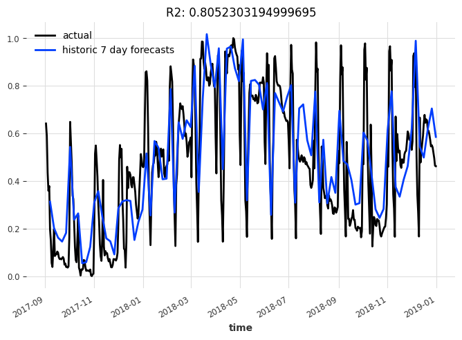
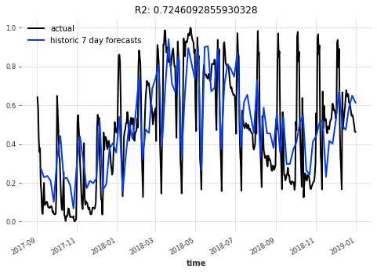
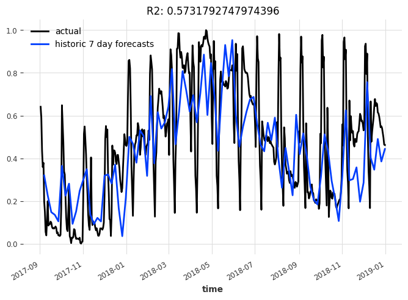
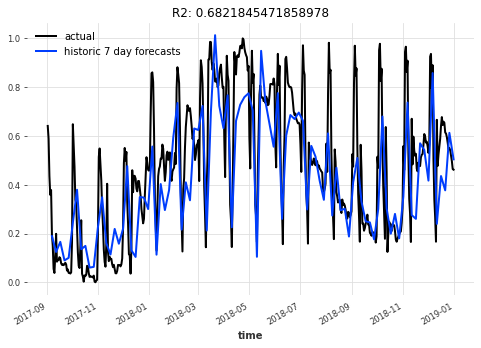

# Exploring Explainable Temporal Convolutions for Time Series Forecasting

## Project Summary

This project is aimed at integrating the ideas from temporal convolutions and NBEATS forecasting models. The ultimate goal being a forecasting model that uses temporal convolutions and is decomposable by trend and seasonality components. While temporal convolutions have been implemented with great success in various other domains with autoregressive data (audio generation most notably with Wavenet), their application to time series analysis has not yeilded state of the art results. This project modifies NBEATS by replacing the fully connected layers in the first part of a "block" with convolutional layers. Because dilated convolutions can accept a large receptive field (and hopefully retain long-term dependencies in the data), the forward and backward predictors are generated from the direct output of the convolutional stack (rather than expanding input dimension through FC layers). The rest of the architecture mirrors NBEATS exactly. Initial results show that this architecture performs comprably to NBEATS and that taking queues form NBEATS in general could be used as a way to provide explainability to all NN based time series modeling.

## Initial Results
Example notebook `examples/07.5-NBEATS-TCN-examples.ipynb`. Note that this is WIP and making changes to notebook might break things.

Initial results show that TCN-NBEATS can meet or exceed NBEATS performance.

TCN-NBEATS with generic stack:\

NBEATS with generic stack:\

However, decomposed results are still in question. It is also possible that the seasonality and trend stacks in the darts implementation of NBEATS may need to be tweaked. Additionally, there is no example pulling out predictions from each stack to view the trend and seasonality components separately.

TCN-NBEATS with decomposed stack:\

NBEATS with decomposed stack:\

## TODO: 

- Add enhancement method to darts api which allows a user to extract trend and seasonality component forecasts for a given NBEATS model.
- Examine trend and seasonality components for TCN-BEATS model.